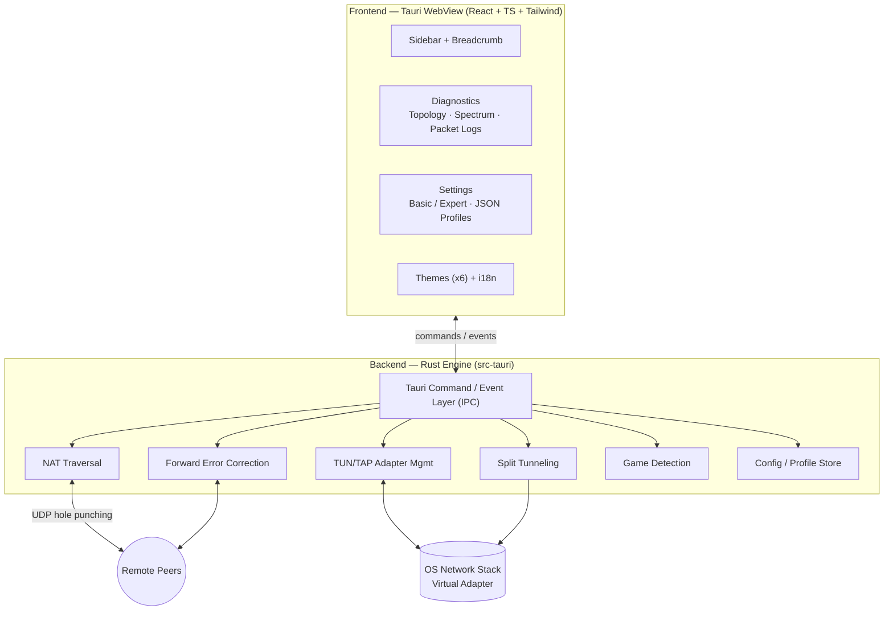

# Player Club Private VPN

> A high-performance, professional-grade **Gaming Virtual Network**. Create secure,
> low-latency virtual LANs over the public internet so geographically separated
> players appear on the same subnet — powered by a **Rust** networking engine and a
> modern **Tauri + React** desktop client.

[](#)
[](#)
[](#)
[](LICENSE)

---

## Table of Contents

1. [Overview](#overview)
2. [Key Features](#key-features)
3. [Technology Stack](#technology-stack)
4. [Architecture](#architecture)
5. [Project Structure](#project-structure)
6. [Getting Started](#getting-started)
7. [Documentation](#documentation)
8. [Development Protocol](#development-protocol)
9. [License](#license)

---

## Overview

**Player Club Private VPN** (*PCP-VPN*) emulates a Local Area Network (LAN) over the
public internet. It lets remote players join the same virtual subnet so that
LAN-only multiplayer titles — and any application expecting peers on the local
network — work as if everyone were in the same room.

The core is a **Rust** engine responsible for NAT traversal, virtual TUN/TAP adapter
management, Forward Error Correction (FEC), and split tunneling. The desktop client
is built with **Tauri**, **React**, **TypeScript**, and **Tailwind CSS**, and
communicates with the engine over Tauri's IPC command/event bridge.

---

## Project Status

> **Alpha — actively building.** The desktop app runs end-to-end (Rust engine boots, frosted-glass shell renders, live telemetry streams to the Diagnostics view). An Expert "real adapter" mode (Windows/Wintun) creates a virtual interface and captures live packets. Two peers can exchange signaling blobs and establish a **direct, authenticated encrypted link** by hole-punching through their NATs (C4); real IP traffic now **tunnels between them over that link** through the virtual adapter (C5), with live RTT and throughput. **Forward Error Correction** (Reed-Solomon) rebuilds lost packets without retransmission — any `r` losses per group (D.1 · D.2), and a **split-tunnel policy** controls which LAN traffic — in-subnet unicast, broadcast, and multicast — the tunnel carries (E.1), with broadcast/multicast forwarding and FEC redundancy now user-configurable from Settings (B.3). The app now also classifies the virtual adapter's network as Private and scopes a firewall allow-rule to it automatically (E.2) — best-effort, and site-to-site LAN sharing (routing a peer's whole real LAN through the tunnel) remains deliberately out of scope, for the same reason relay/TURN is. **Verification note:** the whole path — handshake, crypto, data plane, FEC and split-tunnel policy — is covered end to end by an automated harness (two live pipelines over loopback with mock adapters); **real NAT traversal has not yet been verified on two physical machines** and is the material open risk.

> **Real adapter (Expert, Windows):** creating the Wintun virtual interface requires Administrator privileges. When toggled on without elevation, the engine reports a `Needs Admin` state and offers a one-click relaunch. The signed `wintun.dll` is bundled from [wintun.net](https://www.wintun.net) (see `src-tauri/resources/wintun/NOTICE.txt`).

| Area | State |
| --- | --- |
| Repository scaffold & docs | ✅ Done |
| Tauri 2.x app initialization | ✅ Done |
| Application Shell — 60px sidebar, breadcrumb, golden-ratio layout, 6 themes, frosted-glass settings overlay | ✅ Done |
| Persistent UI state — theme, active route & settings restored across restarts (`zustand/persist`) | ✅ Done |
| Engine telemetry spine — simulated data path + `TelemetrySink` IPC bridge (live stats & packet log) | ✅ Done |
| Virtual adapter (TUN/TAP) — Wintun integration, real packet capture, elevation handling | ✅ Done |
| Transport + STUN — shared UDP socket, reflexive discovery, live RTT/jitter/loss (C1) | ✅ Done |
| Crypto & identity — X25519 identity, Noise IK handshake, AEAD session + anti-replay (C2) | ✅ Done |
| Manual signaling — paste-robust Offer/Answer blobs (pubkey + candidates, CRC32) (C3) | ✅ Done |
| Peer link — NAT hole-punch-as-handshake (fan-out + single-winner nomination), encrypted keepalive RTT (C4) | ✅ Done |
| Data-plane join — virtual adapter ↔ encrypted session, IP packets tunnelled peer-to-peer (C5) | ✅ Done |
| Forward Error Correction — Reed-Solomon over the data plane, recovers any `r` losses per group without retransmit (D.1 · D.2) | ✅ Done |
| Split tunneling — data-plane policy gating unicast/broadcast/multicast into the tunnel (E.1) | ✅ Done |
| Full-path integration harness — two live pipelines over loopback with mock adapters (F.0) | ✅ Done |
| Frontend test foundation — vitest + testing-library, pure logic and store coverage (B.1) | ✅ Done |
| Network page — peer-connection management moved off Diagnostics, first component tests (B.2) | ✅ Done |
| Connection settings — split-tunnel broadcast/multicast + FEC redundancy wired to Settings UI (B.3) | ✅ Done |
| Multi-language (i18n) — English, Traditional Chinese, Simplified Chinese, react-i18next, live switching, persisted | ✅ Done |
| Windows network integration — adapter set to Private, scoped firewall allow-rule, best-effort (E.2) | ✅ Done |
| Site-to-site LAN sharing (peer-advertised routes + remote IP forwarding) | ⏳ Deferred — unverifiable without 3 physical hosts; see CHANGELOG |
| Diagnostics — live telemetry readout ✅ · FEC/policy counters ✅ · two-node topology view ✅ · spectrum chart ✅ | ✅ Done |
| Settings — layered Basic/Expert access (Connection section gated, display-only) | ✅ Done |
| Settings — JSON profile import/export (connection settings only) | ✅ Done |
| Dedicated Minecraft page — settings summary + one-click preset (manual, not process detection) | ✅ Done |
| Networked signaling server — WebSocket host, network name/password gate, live member roster (G.1) | ✅ Done |
| Networked signaling client, auto offer/answer relay, virtual-network UI (G.2–G.4) | ⏳ Planned |

---

## Key Features

> This is the **intended** feature set — the product vision. Each item is tagged
> with its current state: **✅ built**, **🚧 in progress**, **⏳ planned**. The
> [Project Status](#project-status) table above is the authoritative record of
> what actually runs today.

### Networking Engine (Rust)
- ✅ **NAT traversal** — UDP hole-punching / STUN-style peer discovery for direct P2P links. *(Implemented; **not yet verified on two physical machines** — see Project Status.)*
- ✅ **TUN/TAP adapter management** — programmatic creation and lifecycle of the virtual network interface (Windows/Wintun), including automatic Windows network-category and firewall integration (E.2).
- ✅ **Forward Error Correction (FEC)** — Reed-Solomon recovery of lost packets without retransmission.
- ✅ **Split tunneling** — a data-plane policy gating which traffic the tunnel carries, with broadcast/multicast forwarding user-configurable from Settings.
- ✅ **Networked signaling server (Phase G.1)** — an embedded WebSocket server anyone can start to host a Hamachi/Radmin-style virtual network: name + password gate, live member roster broadcast on join/leave. Zero hosted infrastructure — whoever creates the network runs the server; actual traffic stays P2P over the existing NAT hole-punch + encrypted data plane. Not yet wired to any UI or to automatic offer/answer relay — see Project Status.

### Application & UX
- ✅ **60px icon sidebar** with **breadcrumb** pathing for clear navigation.
- ✅ **1.618 golden-ratio** layout grid for balanced composition.
- ✅ **Frosted-glass (Mica) "Settings Overlay"** — theme switcher, language, a Basic/Expert-gated Connection section (split-tunnel forwarding, FEC redundancy), and JSON connection-profile import/export via native save/open dialogs.
- ✅ **Semantic color system** — Cyan (info / idle), Violet (active / primary), Amber (warning), Red (error / critical).
- ✅ **Skeleton-screen** loading states for perceived performance.

### Diagnostics
- ✅ **Live telemetry readout** — RTT / jitter / loss / throughput, FEC-recovered and policy-blocked counters.
- ✅ **Terminal-style packet logs** for low-level inspection.
- ✅ **Topology view** — this node and the negotiated peer, with the link colored by state and live RTT annotated once connected. *(Deliberately a two-node view, not a general graph — the product is strictly point-to-point today.)*
- ✅ **Spectrum chart** — a live tx/rx throughput line chart (hand-rolled SVG, hover crosshair + tooltip) over the most recent samples.

### Settings
- ✅ **Connection settings** — split-tunnel broadcast/multicast forwarding and FEC redundancy (`r`), applied at the next Connect.
- ✅ **Layered access** — Basic mode shows Theme + Language; an Expert toggle reveals Connection settings. Purely a display filter — a setting stays in effect whether or not its section is currently shown.
- ✅ **JSON profile import/export** — save or load the current connection settings (broadcast/multicast forwarding, FEC redundancy) as a versioned JSON file via native save/open dialogs; malformed or incompatible files are rejected with an inline error, never silently coerced.
- ✅ **Dedicated Minecraft page** — its own sidebar entry, showing the current effective connection settings and a one-click preset button (broadcast + multicast forwarding on, FEC redundancy `r = 2`). A manual shortcut, not background process detection — no process scanning, no new OS permissions. Uses a neutral placeholder icon (lucide's `Gamepad2`) pending resolution of Minecraft-branded artwork licensing.

### Personalization
- ✅ **6 predefined visual themes** (Midnight, Carbon, Nebula, Abyss, Aurora, Ember).
- ✅ **Multi-language** support — English, Traditional Chinese (繁體中文), and Simplified Chinese (简体中文), switchable live from Settings, persisted. *(Engine-originated notices and error text remain English — see Scope below.)*

---

## Technology Stack

| Layer            | Technology                          |
| ---------------- | ----------------------------------- |
| Core engine      | Rust                                |
| Desktop shell    | Tauri                               |
| UI framework     | React + TypeScript                  |
| Styling          | Tailwind CSS                        |
| Frontend build   | Vite                                |
| Backend <-> UI   | Tauri commands & events (IPC)       |
| Config format    | JSON (connection / game profiles)   |

### Target Platforms

| Class   | Platforms                     |
| ------- | ----------------------------- |
| Desktop | Windows, macOS, Linux         |
| Mobile  | Android, iOS, iPadOS (Tauri 2.x) |

---

## Architecture

> **Target architecture.** The NAT / TUN / FEC / split-tunnel blocks and the IPC
> layer are built; **Game Detection** and the **Config / Profile Store** are
> planned and shown here for the intended shape.



---

## Project Structure

```text
.
├── src-tauri/                   # Rust / Tauri backend (the networking engine)
│   ├── src/
│   │   ├── engine/              # The engine
│   │   │   ├── crypto/          # X25519 identity, Noise IK, AEAD session, replay
│   │   │   ├── transport/       # Shared UDP socket, framing, keepalive/RTT
│   │   │   ├── nat/             # STUN + candidate gathering
│   │   │   ├── signaling/       # Paste-robust PCPV1 offer/answer blobs
│   │   │   ├── tun/             # Virtual adapter (Wintun) + elevation
│   │   │   ├── dataplane/       # Adapter ⇄ async driver bridge
│   │   │   ├── fec/             # Forward Error Correction (XOR parity)
│   │   │   ├── split_tunnel/    # Egress / ingress packet policy
│   │   │   ├── telemetry/       # Metrics, packet log, sink seam
│   │   │   ├── pipeline.rs      # Handshake → steady-state session driver
│   │   │   └── connection.rs    # Peer link lifecycle
│   │   └── commands/            # Tauri IPC command handlers + event bridge
│   ├── capabilities/            # Tauri permission capabilities
│   ├── resources/wintun/        # Bundled signed wintun.dll (see THIRD-PARTY-NOTICES)
│   └── icons/                   # App icons
├── src/                         # React + TypeScript frontend
│   ├── components/              # Layout shell, diagnostics, settings, primitives
│   ├── pages/                   # Routed views
│   ├── hooks/                   # React hooks
│   ├── stores/                  # Client state (zustand)
│   ├── lib/                     # Frontend utilities / IPC wrappers
│   ├── styles/                  # Global + Tailwind styles
│   ├── themes/                  # Predefined visual themes
│   ├── i18n/locales/            # Translations
│   └── types/                   # Shared TypeScript types
├── public/                      # Static public files
├── README.md                    # This file
├── CHANGELOG.md                 # Versioned change history
├── LICENSE                      # Proprietary licence + disclaimer — read before use
├── SECURITY.md                  # Vulnerability reporting policy
└── THIRD-PARTY-NOTICES.md       # Bundled/third-party component licences
```

---

## Getting Started

The desktop application is initialized and **builds end-to-end**. All commands run from the repository root and use **pnpm**.

### Prerequisites
- **Rust** (stable, MSVC toolchain) — install via [rustup](https://rustup.rs/)
- **Visual Studio C++ Build Tools 2022** — provides the MSVC linker Rust needs on Windows
- **Node.js** 20+ and **pnpm** 10+
- **WebView2 Runtime** — preinstalled on Windows 11

### Install dependencies
```bash
pnpm install
```

### Run in development
```bash
pnpm tauri dev
```

### Build a debug binary (no installer)
```bash
pnpm tauri build --no-bundle --debug
```
Output: `src-tauri/target/debug/player-club-private-vpn.exe`.

### Build release + installers
```bash
pnpm tauri build
```
Release artifacts are produced under `src-tauri/target/release/`, then published to `/Package_Program` (executables) and `/Package_Program_Installer` (installers).

> **App icon** — regenerate from source art with `pnpm tauri icon <square.png>` (outputs to `src-tauri/icons/`). The generator requires a square source ≥ 1024×1024.

> **Dependency note** — `Cargo.lock` pins `alloc-stdlib` (0.2.2) and `brotli-decompressor` (5.0.1) so the graph stays on `alloc-no-stdlib 2.0.x`. Avoid an unscoped `cargo update` of these: `alloc-no-stdlib 3.0.0` is incompatible with `brotli 8.0.3` (E0277).

---

## Documentation

| Resource                  | Location                                              |
| ------------------------- | ----------------------------------------------------- |
| Change history            | [`CHANGELOG.md`](./CHANGELOG.md)                       |
| Licence & acceptable use  | [`LICENSE`](./LICENSE)                                 |
| Security policy           | [`SECURITY.md`](./SECURITY.md)                         |
| Third-party components    | [`THIRD-PARTY-NOTICES.md`](./THIRD-PARTY-NOTICES.md)   |

> User manuals, wiki content and the API/IPC reference are maintained outside
> this repository and are not part of the published source tree.

---

## Development Protocol

This project follows a strict protocol:

1. **Plan first.** Every module is preceded by a logic breakdown or Mermaid flowchart before code is written.
2. **Documentation is mandatory.** `README.md` and `CHANGELOG.md` are updated after **every** modification.
3. **Double-consent on deletion.** Any destructive operation requires explicit two-step confirmation.
4. **Professional, modular code.** Clear separation of concerns across the engine and UI.

---

## License

**Proprietary — All Rights Reserved.** See [`LICENSE`](LICENSE) at the repository root.

> ⚠️ **Read before use.** This is **networking software**. It creates a virtual network
> adapter (requiring Administrator privileges), performs NAT traversal, encrypts traffic
> between peers, and carries arbitrary IP traffic — making remote machines appear on your
> local network. **Misconfiguration or misuse can create serious security risks for you and
> for third parties.** Use it only on networks you own or are explicitly authorised to use,
> and never to circumvent security controls or access systems without permission. The
> software is **pre-release, alpha-quality and has not been security-audited**; it must not
> be relied upon to protect sensitive information. It is provided **"as is", without warranty
> of any kind**, and the copyright holder accepts **no liability** for any damage arising from
> its use. The full disclaimer, acceptable-use conditions and limitation of liability are in
> [`LICENSE`](LICENSE) — read it in full before using or distributing this software.

Bundled third-party components (notably **Wintun**) remain under their own licences; see
[`src-tauri/resources/wintun/NOTICE.txt`](src-tauri/resources/wintun/NOTICE.txt).
